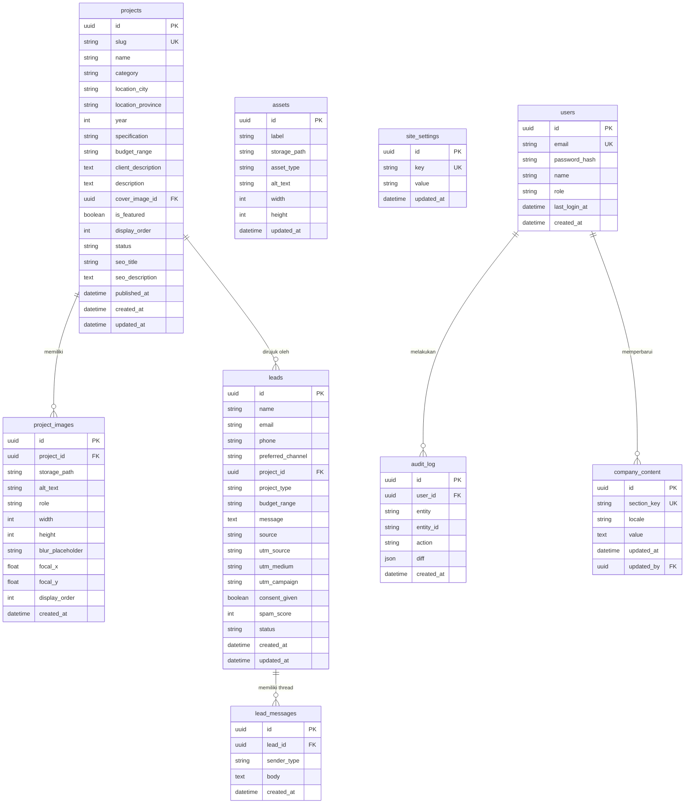
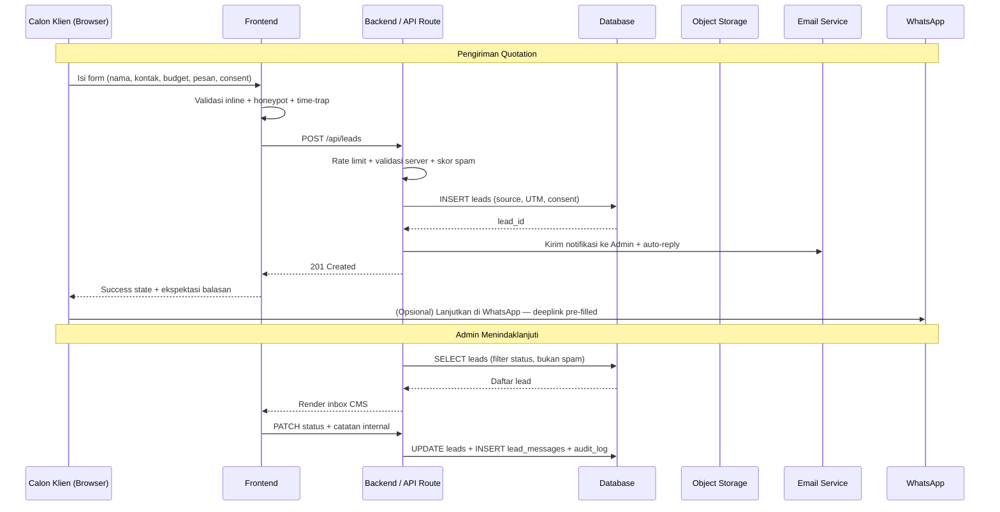
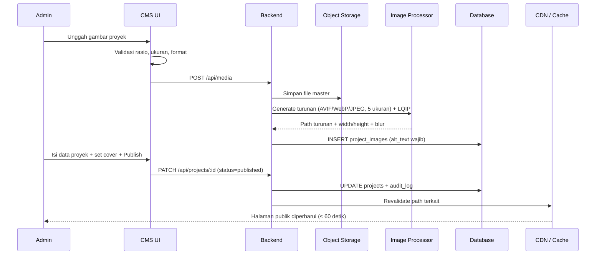

# PRD v2.0 — Trilux Design
## Company Profile & Portfolio — Interior Design & Architecture

| | |
|---|---|
| **Dokumen** | Product Requirements Document (Design-Led) |
| **Versi** | 2.0 — upgrade dari v1.0 |
| **Tanggal** | 18 Agustus 2026 |
| **Sumber Desain** | `Desktop - 2@2x.png` (landing page hi-fi, desktop @2x) |
| **Status** | Draft untuk review stakeholder |

---

## 0. Changelog — Apa yang Di-upgrade dari v1.0

v1.0 sudah benar sebagai *functional spec*, tetapi belum bisa dieksekusi designer maupun developer tanpa banyak asumsi. Delta v2.0:

| # | Area | Kondisi di v1.0 | Perbaikan di v2.0 |
|---|------|-----------------|-------------------|
| 1 | Design System | Tidak ada. Hanya 3 baris "Typography Rules" berisi placeholder yang **bertentangan** dengan mockup (mockup memakai display serif, v1 menulis "Sans: Geist Mono") | §6 Design System lengkap: color token + kontras terukur, type scale, spacing, grid, radius, motion, imagery direction |
| 2 | Spesifikasi Halaman | Fitur ditulis sebagai bullet ("Hero section dengan tagline") | §7 Anatomi per-section 1:1 dengan mockup, termasuk copy slot, hierarki, dan behaviour |
| 3 | Responsive | Hanya kalimat "wajib responsif" | §9 Breakpoint token + aturan reflow per section, mobile-first |
| 4 | Aksesibilitas | Tidak disebut sama sekali | §11 Target WCAG 2.2 AA + temuan kontras kritis (aksen emas **gagal** di atas cream) |
| 5 | Motion | Tidak disebut | §10 Spesifikasi easing, durasi, scroll reveal, `prefers-reduced-motion` |
| 6 | Data Model | 7 tabel, kurang field operasional | §12 ERD v2: slug, kategori, status publish, ordering, featured, alt text, dimensi gambar, locale, UTM |
| 7 | Content Governance | Tidak ada | §12.3 Aturan rasio gambar & batas karakter agar upload Admin tidak merusak layout |
| 8 | Alur Lead | "Chat quotation" in-app, padahal mockup menampilkan CTA **WhatsApp + Email** | §13 Rekonsiliasi jadi model hybrid: form tersimpan di DB + handoff WhatsApp |
| 9 | Anti-spam | Tidak ada | §13.4 Honeypot, rate limit, time-trap, opsi CAPTCHA |
| 10 | SEO | Hanya "SEO-friendly" | §15 Metadata, OG image, sitemap, JSON-LD `LocalBusiness` + `ImageObject` |
| 11 | Performa | Tidak ada | §16 Budget Core Web Vitals + pipeline gambar (kritikal: portfolio = situs berat gambar) |
| 12 | KPI | Tidak ada | §2 Success metrics terukur |
| 13 | Acceptance Criteria | Tidak ada | §19 Kriteria testable per fitur |
| 14 | NFR & Legal | Tidak ada | §17 Security, backup, UU PDP No. 27/2022 |
| 15 | Analytics | Tidak ada | §18 Event taxonomy |
| 16 | Scope Control | Implisit | §4 In/Out of scope + fase rilis |

---

## 1. Overview & Design Intent

### 1.1 Ringkasan Produk
Trilux Design membutuhkan **company profile digital** yang berfungsi ganda: *etalase kredibilitas* (portofolio interior, eksterior, building) sekaligus *kanal akuisisi lead* yang terukur. Situs harus dikelola penuh oleh Admin lewat CMS tanpa menyentuh kode.

Dua sisi pengguna:
- **Public Side (Calon Klien):** melihat profil perusahaan, menjelajah portofolio, mengirim permintaan penawaran.
- **Admin Side (Internal):** mengelola proyek, aset visual, teks perusahaan, dan inbox lead.

### 1.2 Design Intent *(baru di v2)*
Ini bukan situs korporat generik. Berdasarkan mockup, arah desainnya adalah **editorial luxury**: gelap, tenang, banyak ruang kosong, tipografi serif berkontras tinggi dipadu monospace teknis. Lima prinsip yang mengikat seluruh keputusan desain:

1. **Karya dulu, klaim belakangan.** Gambar proyek adalah konten utama; teks berperan sebagai kurasi, bukan promosi. Tanpa stok foto, tanpa badge, tanpa carousel testimonial di MVP.
2. **Tenang, bukan ramai.** Satu warna aksen (brass). Tanpa gradient, tanpa drop shadow dekoratif, tanpa ikon dekoratif. Hierarki dibangun lewat skala dan ruang, bukan warna.
3. **Ritme gelap–terang.** Halaman berselang antara panel *ink* (gelap) dan *bone* (cream) sebagai penanda bab. Ritme ini adalah struktur navigasi visual — wajib dipertahankan saat menambah section baru.
4. **Presisi teknis sebagai signature.** Label monospace bertracking lebar (`— FEATURED PROJECT`, `01`, `01/04`) memberi kesan blueprint arsitektural. Ini pembeda merek — jangan diganti sans-serif biasa.
5. **Performa adalah bagian dari kemewahan.** Situs berat gambar yang lambat merusak persepsi premium lebih parah daripada layout yang kurang cantik.

### 1.3 Positioning Statement
> Untuk pemilik properti dan pengembang di Indonesia yang sedang mencari mitra desain interior/arsitektur, Trilux Design adalah studio yang membuktikan kualitasnya lewat karya yang ditampilkan jujur dan detail — bukan lewat janji pemasaran.

---

## 2. Goals & Success Metrics

### 2.1 Business Goals
| ID | Goal | Metric | Target (90 hari pasca-launch) |
|----|------|--------|-------------------------------|
| G1 | Menghasilkan lead berkualitas | Quotation request tervalidasi / bulan | ≥ 12 |
| G2 | Membangun kredibilitas | Rata-rata scroll depth landing | ≥ 70% |
| G3 | Kedalaman eksplorasi karya | Halaman detail proyek / sesi | ≥ 2,0 |
| G4 | Kemandirian operasional | Waktu Admin publikasi 1 proyek baru | ≤ 15 menit tanpa bantuan developer |
| G5 | Ditemukan lewat pencarian | Halaman publik terindeks Google | 100% dalam 30 hari |

### 2.2 Experience Metrics
| Metric | Target |
|--------|--------|
| LCP (mobile, 4G) | ≤ 2,5 s |
| INP | ≤ 200 ms |
| CLS | ≤ 0,1 |
| Lighthouse Accessibility | ≥ 95 |
| Form completion rate (mulai isi → terkirim) | ≥ 60% |
| Bounce rate landing | ≤ 55% |

### 2.3 Guardrail Metrics
Tidak boleh memburuk demi mengejar metrik lain:
- Spam rate inbox ≤ 5% dari total submission.
- Berat halaman landing ≤ 2,2 MB pada initial viewport load.

---

## 3. Personas & Jobs To Be Done

| Persona | Konteks | Job To Be Done | Kebutuhan Kritis |
|---------|---------|----------------|------------------|
| **Pemilik Rumah** *(primary)* | 30–50 th, membangun/renovasi rumah pribadi, riset via HP malam hari | "Apakah selera studio ini cocok dengan selera saya, dan apakah budget saya masuk?" | Foto besar & tajam, transparansi kisaran budget, kanal kontak instan (WhatsApp) |
| **Pengembang / Kontraktor** *(secondary)* | Mencari partner desain proyek multi-unit | "Apakah mereka pernah menangani skala & tipologi serupa?" | Filter kategori & lokasi, spesifikasi proyek, kesan profesional |
| **Admin Studio** *(internal)* | Non-teknis, mengelola konten sambil menjalankan proyek | "Unggah proyek baru cepat tanpa merusak tampilan situs" | CMS sederhana, preview, panduan rasio gambar, validasi field |

**Konteks perangkat:** asumsi 65–75% traffic mobile. Semua keputusan desain divalidasi di mobile lebih dulu (§9).

---

## 4. Scope

### 4.1 In Scope (MVP)
Landing page (7 section sesuai mockup) · Portfolio index + filter · Detail proyek + galeri · Halaman kontak/quotation · 404 & empty state · CMS (proyek, aset, teks, inbox, login) · SEO dasar + sitemap + JSON-LD · Analytics event tracking.

### 4.2 Out of Scope (MVP)
- Live chat real-time → Fase 3 (MVP memakai form + WhatsApp handoff, §13)
- Multi-role permission (hanya satu peran Admin)
- Pembayaran / e-commerce
- Blog / jurnal
- Multi-bahasa penuh (struktur data disiapkan, implementasi Fase 3 — §12.2)
- Client portal / progress tracking
- 3D viewer / virtual tour

### 4.3 Fase Rilis
| Fase | Isi | Exit Criteria |
|------|-----|---------------|
| **F0 — Foundation** | Design token, komponen dasar, skema DB, auth Admin | Komponen dasar lolos audit kontras §11 |
| **F1 — Public MVP** | Landing, Portfolio, Detail, Kontak, SEO, Analytics | Acceptance criteria §19 lolos; CWV masuk budget §16 |
| **F2 — CMS** | Manajemen proyek, aset, teks, inbox | Admin publikasi proyek < 15 menit tanpa bantuan |
| **F3 — Enhancement** | Chat threaded, i18n ID/EN, blog | Ditentukan pasca-review data Fase 1 |

---

## 5. Information Architecture

### 5.1 Sitemap
```
/                       Landing
/portfolio              Index seluruh proyek + filter (kategori, lokasi, tahun)
/portfolio/[slug]       Detail proyek + galeri + CTA quotation
/services               Layanan (Interior · Eksterior · Building)
/contact                Kontak + form quotation
/404                    Not found
/admin/login            Login Admin
/admin                  Dashboard (ringkasan lead & konten)
/admin/projects         List / Create / Edit / Delete proyek
/admin/assets           Manajemen aset visual
/admin/content          Edit teks company info
/admin/inbox            Inbox quotation + detail thread
```

### 5.2 Navigasi Utama
Sesuai mockup: **split nav** dengan logo di tengah.

`STORY · PORTFOLIO · [LOGO] · SERVICES · CONTACT`

- **Desktop:** sticky, transparan di atas hero, berubah `ink/95` + hairline bawah setelah scroll > 80px.
- **Mobile:** logo tengah, ikon menu kanan → overlay full-screen, item serif 32px, CTA WhatsApp di dasar overlay.
- Item aktif ditandai underline brass 1px, bukan perubahan warna teks (menjaga kontras).

### 5.3 Anchor Mapping *(sering keliru — ditetapkan eksplisit)*
`STORY` → `#welcome` · `PORTFOLIO` → `/portfolio` · `SERVICES` → `/services` (halaman penuh) · `CONTACT` → `#contact`.

---

## 6. Design System

Seluruh nilai di bawah adalah **token**, bukan nilai hardcode. Definisikan sekali sebagai CSS custom property / theme config, lalu konsumsi di semua komponen.

### 6.1 Color Tokens

**Palet inti — diturunkan dari mockup**

| Token | Hex | Peran |
|-------|-----|-------|
| `--ink-900` | `#141010` | Dasar hero, overlay paling gelap |
| `--ink-800` | `#1B1512` | **Dasar panel gelap (primary surface)** |
| `--ink-700` | `#241C18` | Surface bertingkat di panel gelap (card, input) |
| `--bone-100` | `#EFE9DC` | **Dasar panel terang (cream)** |
| `--bone-200` | `#E4DCCB` | Surface bertingkat di panel terang |
| `--brass-500` | `#C08A3E` | Aksen di panel gelap (logo, numbering, link) |
| `--brass-700` | `#8A5F1E` | Aksen di panel terang — lihat §6.2 |
| `--brass-300` | `#E4C07A` | Hover / focus state di panel gelap |
| `--text-on-ink` | `#F2EDE4` | Teks utama di panel gelap |
| `--text-on-ink-muted` | `#A89F92` | Teks sekunder di panel gelap |
| `--text-on-bone` | `#221C18` | Teks utama di panel terang |
| `--text-on-bone-muted` | `#6B6259` | Teks sekunder di panel terang |
| `--rule-on-ink` | `rgba(242,237,228,.14)` | Hairline pemisah di panel gelap |
| `--rule-on-bone` | `rgba(34,28,24,.12)` | Hairline pemisah di panel terang |
| `--danger` | `#B4453A` | Error state form |
| `--success` | `#4F7A52` | Success state form |

**Aturan pemakaian**
- Aksen brass hanya untuk: logo, penomoran, hairline aktif, ikon arrow, dan hover link. **Tidak untuk fill tombol besar** — merusak ketenangan palet.
- Tombol primer = outline 1px + label; tombol solid hanya di CMS.
- Semua overlay gambar memakai `--ink-900` dengan opasitas, bukan hitam murni (menjaga kehangatan warna).

### 6.2 Temuan Kontras Kritis *(hasil audit, wajib ditindaklanjuti)*

Rasio dihitung dengan formula WCAG 2.x relative luminance:

| Kombinasi | Rasio | WCAG AA | Putusan |
|-----------|-------|---------|---------|
| `--text-on-ink` `#F2EDE4` di `--ink-800` | **15,5 : 1** | Lolos AAA | Aman |
| `--text-on-ink-muted` `#A89F92` di `--ink-800` | **6,9 : 1** | Lolos AA | Aman |
| `--brass-500` `#C08A3E` di `--ink-800` | **6,0 : 1** | Lolos AA | Aman |
| `--text-on-bone` `#221C18` di `--bone-100` | **13,9 : 1** | Lolos AAA | Aman |
| `--text-on-bone-muted` `#6B6259` di `--bone-100` | **4,9 : 1** | Lolos AA (batas tipis) | Aman, jangan diperterang |
| ⚠️ `--brass-500` `#C08A3E` di `--bone-100` | **2,5 : 1** | **GAGAL** (butuh 4,5:1; bahkan gagal 3:1 untuk teks besar) | **Wajib diganti** |

**Aksi wajib:** setiap teks, ikon, atau garis fungsional beraksen brass di panel cream harus memakai `--brass-700` `#8A5F1E` (**4,6 : 1**, lolos AA). `--brass-500` di panel cream hanya boleh untuk elemen dekoratif non-informatif. Ini menyentuh label `ABOUT US`, `Featured Project`, penomoran `01/04`, dan pagination dot di section *Selected Work*.

### 6.3 Typography

Mockup memakai pasangan **display serif + monospace**. Spesifikasi v1 ("Sans: Geist Mono") keliru dan digantikan.

| Peran | Font | Fallback Stack | Pemakaian |
|-------|------|----------------|-----------|
| **Display** | `Playfair Display` (gratis) — alternatif berbayar: `Canela` / `Ogg` | `Playfair Display, "Times New Roman", Georgia, serif` | H1–H3, nama proyek, quote |
| **Body / UI** | `JetBrains Mono` | `JetBrains Mono, "Geist Mono", ui-monospace, SFMono-Regular, monospace` | Paragraf, label, nav, tombol, form |
| **Numeric** | `JetBrains Mono` (tabular figures) | — | Penomoran, budget, pagination |

Weight yang di-load dibatasi tiga: Display 400 & 500, Mono 400 & 500. Setiap penambahan weight harus disetujui — tiap weight menambah ±25 KB.

**Type Scale (fluid, `clamp()` — mobile → desktop)**

| Token | Ukuran | Line-height | Tracking | Font |
|-------|--------|-------------|----------|------|
| `display-xl` | `clamp(3.25rem, 8vw, 7rem)` | 0,95 | −0,02em | Display |
| `display-l` | `clamp(2.25rem, 5vw, 3.5rem)` | 1,05 | −0,015em | Display |
| `display-m` | `clamp(1.75rem, 3.5vw, 2.5rem)` | 1,15 | −0,01em | Display |
| `title-s` | `clamp(1.125rem, 2vw, 1.375rem)` | 1,3 | 0 | Display |
| `body-l` | `1rem` | 1,7 | 0 | Mono |
| `body-m` | `0.875rem` | 1,7 | 0 | Mono |
| `body-s` | `0.8125rem` | 1,6 | 0 | Mono |
| `label` | `0.6875rem` | 1,4 | **+0,18em**, uppercase | Mono |
| `eyebrow` | `0.75rem` | 1,4 | **+0,14em**, uppercase, diawali `—` | Mono |

**Aturan tipografi**
- Ukuran teks terkecil di halaman publik = 13 px (`body-s`). Label 11 px hanya untuk teks non-esensial berjarak lebar; jangan dipakai untuk informasi kritis.
- Panjang baris paragraf: 60–75 karakter (`max-width: 62ch`).
- Heading display tidak pernah uppercase — kontrasnya datang dari skala.
- Angka selalu tabular (`font-variant-numeric: tabular-nums`) supaya pagination & harga tidak bergeser.

### 6.4 Spacing & Layout

**Spacing scale** (basis 4 px): `4 · 8 · 12 · 16 · 24 · 32 · 48 · 64 · 96 · 128 · 160 · 200`

**Grid**
| Breakpoint | Kolom | Gutter | Margin | Max content |
|------------|-------|--------|--------|-------------|
| ≥ 1440px | 12 | 24px | 80px | 1360px |
| 1024–1439px | 12 | 24px | 48px | fluid |
| 768–1023px | 8 | 20px | 40px | fluid |
| < 768px | 4 | 16px | 20px | fluid |

**Section rhythm (padding vertikal)**
| Breakpoint | Padding atas/bawah section |
|------------|---------------------------|
| Desktop | 160px |
| Tablet | 112px |
| Mobile | 72px |

Ruang kosong adalah elemen desain di sini. Mengurangi padding section demi "memuat lebih banyak konten" adalah pelanggaran design intent — konten yang berlebih harus dipotong, bukan ruangnya.

### 6.5 Radius, Border, Elevation
- `--radius-none: 0` — default untuk panel & gambar besar (bahasa arsitektural).
- `--radius-sm: 2px` — tombol, input, chip.
- `--radius-pill: 999px` — hanya untuk pagination dot & caption chip (mis. `Padang — Residence`).
- Border: selalu **1px hairline**, warna `--rule-on-ink` / `--rule-on-bone`. Tidak ada border 2px.
- **Tanpa box-shadow** di halaman publik. Kedalaman dibangun oleh overlay dan perbedaan surface. Shadow hanya boleh di CMS (dropdown, modal).

### 6.6 Iconography
- Stroke 1,25px, ujung siku (bukan rounded), ukuran 16/20/24px.
- Set terbatas: arrow-right, arrow-up, plus, minus, close, menu, chevron. Tidak ada ikon ilustratif.
- Arrow `→` boleh dipakai sebagai glyph teks di tombol (sesuai mockup: `View Project →`).

### 6.7 Imagery Direction
Gambar adalah 80% dari kesan merek. Aturan kurasi:
- **Konsisten temperatur warna:** hangat, lampu tungsten terlihat, tanpa filter HDR agresif.
- **Tanpa manusia** di foto interior kecuali sebagai skala yang halus.
- **Rasio yang diizinkan:** `16:9` (hero), `4:5` (potret section), `3:2` (cover proyek), `1:1` (thumbnail). Selain itu ditolak CMS.
- Overlay hero: `linear-gradient(180deg, rgba(20,16,16,.72) 0%, rgba(20,16,16,.35) 45%, rgba(20,16,16,.85) 100%)` — memastikan teks putih tetap lolos kontras di semua foto.
- Setiap gambar wajib punya `alt` deskriptif (§11) dan dimensi intrinsik tersimpan (§16.3, mencegah CLS).

---

## 7. Spesifikasi Halaman — Landing Page

Section berikut dipetakan 1:1 dari mockup, berurutan dari atas.

### S1 — Hero *(panel: ink)*
| Elemen | Spesifikasi |
|--------|-------------|
| Background | Foto interior full-bleed, tinggi `100svh` (bukan `vh` — hindari lompatan address bar mobile), `object-fit: cover`, + overlay §6.7 |
| Eyebrow | `— Portfolio + Interior Design & Architecture` · token `eyebrow` · brass-500 |
| Judul | `Trilux Design` · `display-xl` · dua baris · text-on-ink |
| Sub | 2 baris pendek (mis. *"Spaces built on precision. Finished with warmth."*) · `body-m` · muted · maks 90 karakter |
| Kiri bawah | `— Scroll to explore` + garis animasi 32px (loop halus) |
| Kanan bawah | Tombol outline `View Project →` → `/portfolio` |
| Behaviour | Gambar `priority` / eager (ini elemen LCP). Tanpa autoplay video di MVP. |

**Mobile:** judul turun ke `display-l`, tombol menjadi full-width di bawah sub-teks, indikator scroll disembunyikan.

### S2 — Welcome *(panel: ink)*
- **Layout desktop:** 2 kolom — teks kiri (5 kolom), gambar kanan (6 kolom, rasio 1:1), offset vertikal ±48px agar tidak sejajar kaku.
- Eyebrow `— Welcome` · Judul `Welcome to Trilux Design` (`display-l`).
- Sub-italic 1 baris + paragraf `body-m` maksimal 320 karakter.
- **Caption chip** di bawah gambar: `Padang — Residence` · `radius-pill` · border hairline · `label`. Chip ini adalah metadata proyek — harus terisi dari data, bukan hardcode.
- **Mobile:** gambar di atas teks (visual dulu), stack penuh.

### S3 — Mission & Philosophy *(panel: bone)*
- Eyebrow `ABOUT US` (memakai `--brass-700`, lihat §6.2).
- Judul `Mission and Philosophy` (`display-l`).
- **Layout:** gambar kiri (rasio 4:5, 5 kolom) + dua blok teks kanan (`Mission`, `Our Approach`), dipisah hairline `--rule-on-bone`.
- Setiap blok: `title-s` + paragraf `body-m` maks 280 karakter.
- **Mobile:** gambar penuh, dua blok teks bertumpuk dengan hairline pemisah.

### S4 — Our Expertise *(panel: ink)*
- Eyebrow `Capabilities` · Judul `Our Expertise`.
- **Grid 2×2** berpenomoran `01`–`04` (brass-500, token `label`), tiap sel: judul `title-s` + deskripsi `body-s` (maks 200 karakter).
- Hairline horizontal memisahkan baris; hairline vertikal memisahkan kolom (desktop saja).
- Item default: *Pioneering Sustainability · Creative Innovation · Intelligent Functionality · Collaborative Excellence*.
- **Editable via CMS**, jumlah 4–6 item. Jika ganjil, sel terakhir merentang penuh.
- **Mobile:** 1 kolom, hairline hanya horizontal.

### S5 — Selected Work *(panel: bone)* — section terpenting
| Elemen | Spesifikasi |
|--------|-------------|
| Eyebrow | `— Featured Project` |
| Judul | `Selected Work` |
| Index | `01/04` (brass-700) + nama proyek `display-m` sejajar baseline |
| Lokasi | `PADANG, WEST SUMATERA` · `label` · muted |
| Meta row | 3 kolom: **Project Specifics** · **Budget** · **Client Description**, tiap kolom `label` (judul) + `body-s` (nilai) |
| Pagination | 4 dot bernomor kanan atas; aktif = fill brass-700, inaktif = outline hairline. **Wajib `<button>` dengan `aria-label="Lihat proyek 2"`**, bukan `<div>` |
| Media utama | Cover proyek rasio 3:2, full width kolom konten |
| Bawah | Deskripsi kiri (`body-s`, maks 420 karakter) + 3 thumbnail kanan (rasio 1:1, gap 16px) |
| Interaksi | Klik thumbnail → tukar media utama (crossfade 240ms). Klik media utama → `/portfolio/[slug]` |
| Sumber data | 4 proyek dengan `is_featured = true`, diurut `display_order` |

**Mobile:** meta row jadi 1 kolom stack; thumbnail jadi baris horizontal scroll-snap; pagination pindah ke bawah media.

### S6 — Contact *(panel: ink)*
- Eyebrow `— Contact` · Judul `Let's build something timeless.` (`display-l`).
- Gambar eksterior kiri (rasio 4:5), konten kanan.
- Sub-teks pengundang (maks 160 karakter) — mengelola ekspektasi respons: *"Kami biasanya membalas dalam satu hari kerja."*
- **Grid kontak 2×2:** Phone · Social · Email · Location. Nilai dari `site_settings`, bukan hardcode.
- **CTA:** `Email Us →` (mailto) dan `Whatsapp →` (`wa.me` deeplink dengan pesan pre-filled, §13.2).
- **Tambahan v2:** tautan sekunder `Kirim detail proyek →` menuju form `/contact` untuk lead yang butuh brief panjang. Tanpa ini, seluruh lead lari ke WhatsApp dan tidak tercatat di CMS (§13.1).

### S7 — Footer *(panel: ink)*
- Kiri: `© 2026 Trilux Design · Interior · Exterior · Building`.
- Kanan: `Back to top ↑` (smooth scroll, hormati `prefers-reduced-motion`).
- Hairline atas. Tinggi kompak, padding vertikal 32px.

---

## 8. Component Inventory

Setiap komponen harus dibuat dengan seluruh state di bawah sebelum dipakai di halaman.

| Komponen | Varian | State wajib |
|----------|--------|-------------|
| `Button` | outline-on-ink, outline-on-bone, solid (CMS only) | default, hover, focus-visible, active, disabled, loading |
| `NavBar` | transparent, solid | default, scrolled, mobile-open, item-active |
| `Eyebrow` | on-ink, on-bone | — |
| `SectionHeader` | — | — |
| `ProjectCard` | featured, grid, compact | default, hover (image scale 1,03 + caption naik), focus-visible |
| `MediaFrame` | 16:9, 4:5, 3:2, 1:1 | loading (skeleton `--ink-700`/`--bone-200`), loaded, error (fallback + alt) |
| `Thumbnail` | — | default, active, hover, focus-visible |
| `Pagination` | dots | default, active, hover, focus-visible, disabled |
| `MetaRow` | 3-col, stacked | — |
| `FilterChip` | on-bone | default, selected, hover, focus-visible, disabled |
| `Input` / `Textarea` / `Select` | — | default, focus, filled, error + pesan, disabled |
| `Form` | quotation | idle, validating, submitting, success, error, rate-limited |
| `Toast` | success, error | — |
| `EmptyState` | no-projects, no-results, no-messages | — |
| `Modal` | CMS only | open, close, focus-trapped |
| `Uploader` | CMS only | idle, dragover, uploading + progress, success, error (ukuran/rasio/format) |

**Aturan focus-visible (mudah terlewat pada desain gelap):** outline 2px `--brass-300` + offset 2px, tidak pernah `outline: none` tanpa pengganti setara. Diuji dengan navigasi keyboard penuh.

---

## 9. Responsive Specification

| Token | Lebar | Perangkat acuan |
|-------|-------|-----------------|
| `xs` | < 480px | HP kecil |
| `sm` | 480–767px | HP |
| `md` | 768–1023px | Tablet potret |
| `lg` | 1024–1439px | Laptop |
| `xl` | ≥ 1440px | Desktop besar |

**Aturan lintas breakpoint**
1. **Mobile-first.** Layout desktop adalah enhancement, bukan sebaliknya.
2. **Target sentuh minimal 44×44px** untuk semua kontrol (pagination dot di mockup terlalu kecil di mobile — perbesar area sentuh via padding transparan).
3. **Tanpa horizontal scroll** kecuali disengaja (rail thumbnail dengan `scroll-snap`).
4. **Hover tidak pernah menyembunyikan informasi.** Semua caption dan meta harus terbaca di sentuh, tanpa hover.
5. Gunakan `100svh`/`100dvh`, bukan `100vh`.
6. Gambar `object-position` per aset dapat diatur Admin (`focal_x`, `focal_y`) agar crop mobile tidak memotong subjek.

**Reflow per section:** lihat catatan "Mobile:" pada tiap section di §7.

---

## 10. Motion & Interaction

### 10.1 Token
| Token | Nilai |
|-------|-------|
| `--ease-out` | `cubic-bezier(0.22, 1, 0.36, 1)` |
| `--ease-in-out` | `cubic-bezier(0.65, 0, 0.35, 1)` |
| `--dur-fast` | 160 ms (hover, focus) |
| `--dur-base` | 280 ms (transisi UI, crossfade) |
| `--dur-slow` | 560 ms (reveal, image) |
| `--stagger` | 60 ms |

### 10.2 Pola
- **Scroll reveal:** opacity 0 → 1, translateY 12px → 0, `--dur-slow`, trigger saat 15% elemen masuk viewport, **sekali saja** (tidak berulang saat scroll balik).
- **Media reveal:** scale 1,04 → 1 bersamaan fade. Tanpa parallax berat — biaya performa tinggi, nilai tambah kecil.
- **Hover card:** gambar scale 1,03, `--dur-base`. Teks tidak ikut bergerak.
- **Crossfade thumbnail → media utama:** `--dur-base`, tanpa pergeseran layout.
- **Nav scroll transition:** background + hairline `--dur-base`.
- **Page transition:** fade sederhana 200 ms. Tidak ada transisi rumit yang menunda LCP.

### 10.3 Aturan
- Tidak ada animasi yang menunda konten kritis. Konten harus tetap terbaca jika JS gagal (reveal memakai fallback `opacity: 1` di `<noscript>` / saat JS error).
- **`prefers-reduced-motion: reduce` wajib dihormati:** semua translate/scale dinonaktifkan, sisakan fade ≤ 120 ms; smooth scroll jadi instan.
- Tanpa animasi looping berkelanjutan kecuali indikator scroll hero (dan itu pun berhenti saat reduced-motion).

---

## 11. Accessibility Specification

**Target: WCAG 2.2 Level AA.**

| Area | Requirement |
|------|-------------|
| Kontras | Semua teks ≥ 4,5:1 (≥ 3:1 untuk ≥ 24px atau ≥ 19px bold). Ikon & batas kontrol ≥ 3:1. Lihat temuan §6.2. |
| Keyboard | Seluruh alur (nav, filter, pagination, galeri, form, CMS) dapat dioperasikan dengan keyboard. Urutan tab logis. Tanpa keyboard trap. |
| Focus | `:focus-visible` selalu terlihat, kontras ≥ 3:1 terhadap latar. |
| Skip link | "Lewati ke konten utama" sebagai elemen fokus pertama. |
| Semantik | Satu `<h1>` per halaman, hierarki heading tanpa lompatan. Landmark `header`/`nav`/`main`/`footer`. |
| Gambar | `alt` deskriptif untuk gambar informatif (diisi Admin, **field wajib** di CMS); `alt=""` untuk dekoratif. |
| Form | `<label>` terkait eksplisit; error diumumkan via `aria-live="polite"`; error menjelaskan cara perbaikan, bukan sekadar "invalid". |
| Motion | `prefers-reduced-motion` dihormati (§10.3). |
| Bahasa | `<html lang="id">` (atau `en` sesuai keputusan §12.2). |
| Zoom | Layout tetap utuh pada zoom 200% dan reflow 320px CSS. |
| Target size | Minimal 24×24px (WCAG 2.2 SC 2.5.8); direkomendasikan 44×44px. |

**Definition of Done aksesibilitas:** axe DevTools 0 violation kritis · navigasi keyboard penuh tanpa mouse · uji screen reader pada alur "temukan proyek → kirim quotation" · Lighthouse A11y ≥ 95.

---

## 12. Content Model & CMS Data

### 12.1 ERD v2



**Field baru vs v1 dan alasannya**

| Field | Alasan |
|-------|--------|
| `slug` | URL SEO-friendly (`/portfolio/padang-residence-i`) — v1 hanya punya id numerik |
| `category`, `year` | Filter di halaman Portfolio; v1 menjanjikan filter tanpa field pendukung |
| `status` (`draft`/`published`) | Admin bisa menyiapkan proyek tanpa langsung tayang |
| `is_featured`, `display_order` | Section *Selected Work* butuh kurasi 4 proyek terurut |
| `cover_image_id` | Menentukan gambar mana yang jadi cover; v1 tidak punya penentu |
| `alt_text` | Wajib untuk aksesibilitas & SEO gambar |
| `width`, `height`, `blur_placeholder` | Mencegah CLS + LQIP placeholder |
| `focal_x`, `focal_y` | Crop mobile tidak memotong subjek |
| `role` (`cover`/`gallery`/`thumb`) | Satu tabel gambar melayani banyak posisi layout |
| `budget_range` | String bebas berisiko; gunakan enum terkontrol (§12.3) |
| `locale` di `company_content` | Menyiapkan i18n tanpa migrasi ulang |
| `site_settings` | Telepon, email, WA, IG, alamat — jangan hardcode di komponen |
| `leads.*` (UTM, consent, spam_score, source) | Atribusi kanal, kepatuhan UU PDP, filter spam |
| `audit_log` | Melacak siapa mengubah apa — penting saat konten "tiba-tiba berubah" |
| `users.role` | Disiapkan untuk multi-role di masa depan meski MVP satu peran |

### 12.2 Keputusan Bahasa *(open question, butuh keputusan stakeholder)*
Mockup berbahasa Inggris, pasar utama berbahasa Indonesia. Tiga opsi:
- **A — Inggris saja:** paling sesuai mockup, kesan internasional; berisiko menurunkan konversi lead lokal.
- **B — Indonesia saja:** konversi terbaik untuk pemilik rumah lokal; nada premium sedikit berubah.
- **C — ID/EN toggle (Fase 3):** terbaik, biaya konten 2×.

**Rekomendasi:** heading & label tetap Inggris (elemen merek), **seluruh teks substantif dan copy form berbahasa Indonesia**. Skema `locale` sudah disiapkan untuk migrasi ke opsi C tanpa perubahan struktur.

### 12.3 Content Governance *(baru — mencegah CMS merusak desain)*

| Field | Batas | Perilaku saat dilanggar |
|-------|-------|-------------------------|
| Nama proyek | 40 karakter | Counter + tolak simpan |
| Sub-hero | 90 karakter | Counter + peringatan |
| Deskripsi Welcome | 320 karakter | Counter + peringatan |
| Deskripsi Mission / Approach | 280 karakter | Counter + peringatan |
| Deskripsi Expertise | 200 karakter | Counter + peringatan |
| Deskripsi proyek (featured) | 420 karakter | Truncate + `Baca selengkapnya →` ke halaman detail |
| Alt text | 125 karakter, **wajib** | Blokir simpan |
| Cover proyek | Rasio 3:2, min 2000px sisi panjang, ≤ 8 MB, JPG/PNG/WebP | Tolak unggah + pesan jelas |
| Thumbnail galeri | Rasio 1:1 atau 4:5 | Tawarkan crop otomatis dengan preview |
| Hero image | Rasio 16:9, min 2400px | Tolak unggah |
| Featured project | Tepat 4 item | Peringatkan jika ≠ 4; publik menampilkan 4 pertama |
| `budget_range` | Enum: `< 500 Jt` · `500 Jt – 1 M` · `1 – 3 M` · `3 – 5 M` · `> 5 M` · `Dirahasiakan` | Dropdown, bukan input bebas |
| `category` | Enum: `Interior` · `Exterior` · `Building` · `Renovation` | Dropdown |

Aturan ini adalah kontrak antara desain dan CMS. Tanpanya, layout akan rusak pada unggahan pertama yang tidak sesuai.

---

## 13. Alur Lead & Quotation *(revisi besar dari v1)*

### 13.1 Masalah yang Diperbaiki
v1 menetapkan "chat quotation" tersimpan di database dengan Admin membalas via CMS. Namun mockup hanya menampilkan CTA **Email Us** dan **Whatsapp** — keduanya membawa pengguna **keluar dari situs**. Jika dibiarkan, akibatnya:
- Tidak ada lead yang tercatat di CMS → §2 G1 tidak bisa diukur.
- Fitur inbox CMS dibangun tapi kosong.
- Tidak ada atribusi kanal (proyek mana yang menghasilkan lead).

### 13.2 Model yang Ditetapkan: Hybrid Capture
1. **Form on-site** (`/contact` dan CTA di halaman detail proyek) adalah jalur utama pencatatan. Field: Nama*, WhatsApp/Telepon*, Email, Jenis proyek (enum), Kisaran budget (enum), Lokasi, Pesan*, Kanal balasan pilihan (WhatsApp/Email), checkbox persetujuan data*.
2. Submit → simpan ke `leads` → kirim notifikasi email ke Admin → tampilkan success state dengan ekspektasi waktu balas.
3. **Setelah sukses**, tampilkan opsi lanjutan: `Lanjutkan di WhatsApp →` dengan deeplink `wa.me` berisi pesan pre-filled (nama + ID lead + nama proyek). Lead sudah tercatat sebelum berpindah kanal.
4. Tombol WhatsApp langsung (tanpa form) tetap ada di S6 dan nav mobile, tapi diberi parameter tracking sehingga sumbernya terekam sebagai `source = whatsapp_direct`.
5. Admin membalas lewat WhatsApp/email, lalu **mencatat status** di CMS (`new` → `contacted` → `quoted` → `won`/`lost`) dan boleh menyimpan catatan internal di `lead_messages`.

**Chat threaded real-time ditunda ke Fase 3.** Di pasar Indonesia, memaksa calon klien memakai inbox web menurunkan konversi dibanding WhatsApp.

### 13.3 State Form
`idle → validating → submitting (tombol loading, form terkunci) → success | error`
- **Validasi inline** saat blur, bukan saat submit.
- **Error jaringan:** isian dipertahankan + tombol coba lagi. Tidak boleh menghapus input pengguna.
- **Success state** menggantikan form di tempat (tidak redirect), berisi: konfirmasi, ekspektasi waktu balas, CTA WhatsApp, dan tautan kembali ke portfolio.

### 13.4 Anti-Spam & Rate Limit
| Lapis | Mekanisme |
|-------|-----------|
| 1 | Honeypot field tersembunyi (`aria-hidden`, `tabindex="-1"`) |
| 2 | Time-trap: submit < 3 detik sejak render → ditandai `spam_score +40` |
| 3 | Rate limit per IP: 5 submit / jam (HTTP 429 dengan pesan ramah) |
| 4 | Validasi format nomor telepon Indonesia (`+62` / `08`) |
| 5 | Cloudflare Turnstile — diaktifkan hanya jika spam rate > 5% (§2.3) |
| 6 | Semua submission tetap disimpan; yang berskor tinggi masuk tab **Spam**, tidak dihapus otomatis |

### 13.5 Notifikasi
- Email ke Admin dalam ≤ 1 menit, subjek: `[Lead Baru] {Nama} — {Jenis Proyek}`, isi seluruh field + tautan langsung ke detail lead di CMS.
- Opsional Fase 2: notifikasi WhatsApp Business API.
- Auto-reply ke pengirim (jika email diisi): konfirmasi + ekspektasi waktu balas.

---

## 14. Admin CMS — UX Requirements

CMS memakai bahasa visual berbeda dari situs publik: **fungsional, terang, padat**. Jangan paksakan estetika editorial gelap ke tooling internal.

| Layar | Requirement |
|-------|-------------|
| **Login** | Email + password, rate limit 5 percobaan / 15 menit, pesan error generik (tidak membocorkan email terdaftar), sesi 7 hari dengan opsi "ingat saya" |
| **Dashboard** | Ringkasan: lead baru (7 hari), total proyek published/draft, aset terakhir diunggah, tautan aksi cepat |
| **List Proyek** | Tabel dengan kolom cover · nama · kategori · status · featured · terakhir diubah. Pencarian, filter status, drag-to-reorder untuk `display_order` |
| **Editor Proyek** | Form satu halaman bertingkat (Info → Media → SEO → Publikasi). Auto-save draft tiap 30 detik. **Preview** membuka halaman publik dalam mode draft. Counter karakter sesuai §12.3 |
| **Uploader Media** | Drag & drop multi-file, progres per file, urutan drag, penunjukan cover, field alt text **wajib**, validasi rasio dengan pesan spesifik ("Butuh rasio 3:2, file Anda 4:3 — crop otomatis?") |
| **Konten Perusahaan** | Edit per `section_key` dengan label manusiawi ("Judul Hero", "Paragraf Welcome"), bukan key mentah, disertai thumbnail lokasi tampilnya di halaman |
| **Inbox Lead** | List dengan status, filter, tab Spam terpisah, detail lead, tombol salin nomor, deeplink "Balas via WhatsApp", ubah status, catatan internal |
| **Semua layar** | Konfirmasi destruktif dua langkah (ketik nama proyek untuk menghapus), soft delete 30 hari, toast undo, audit log |

**Prinsip CMS:** Admin non-teknis. Setiap field punya helper text. Setiap error menyebutkan cara memperbaiki. Tidak ada istilah teknis (`slug` → "Alamat URL halaman").

---

## 15. SEO & Metadata

| Item | Requirement |
|------|-------------|
| Rendering | Halaman publik SSG/SSR — HTML terisi konten tanpa JS |
| Title | `{Nama Proyek} — Trilux Design` (maks 60 karakter), landing: `Trilux Design — Interior, Eksterior & Arsitektur` |
| Meta description | 150–160 karakter, dapat diisi Admin, fallback dari deskripsi proyek |
| Canonical | Wajib di semua halaman |
| Open Graph / Twitter Card | `og:title`, `og:description`, `og:image` (1200×630, digenerate dari cover proyek), `og:type` |
| Sitemap | `/sitemap.xml` otomatis, hanya `status = published` |
| Robots | `/robots.txt`, blokir `/admin/*` |
| Structured data | JSON-LD `Organization` + `LocalBusiness` (nama, telepon, alamat, `sameAs` Instagram) di landing; `CreativeWork`/`ImageObject` di detail proyek; `BreadcrumbList` |
| URL | Lowercase, kebab-case, tanpa parameter di halaman kanonik; slug tidak berubah setelah publish (jika berubah → 301) |
| Alt text | Wajib, dipakai sebagai sinyal image search (§12.3) |
| Heading | Satu `<h1>`, hierarki rapi (§11) |
| i18n | `lang` + `hreflang` disiapkan jika opsi C (§12.2) dipilih |

---

## 16. Performance Budget & Image Pipeline

Situs portofolio arsitektur = situs berat gambar. Ini adalah risiko teknis nomor satu proyek. Sebagai kalibrasi: satu mockup desktop @2x saja berukuran 13 MB — tanpa pipeline yang disiplin, landing page akan gagal total di 4G.

### 16.1 Budget
| Metric | Budget |
|--------|--------|
| LCP (mobile 4G) | ≤ 2,5 s |
| CLS | ≤ 0,1 |
| INP | ≤ 200 ms |
| TTFB | ≤ 600 ms |
| Total transfer initial viewport | ≤ 1,2 MB |
| Total transfer halaman penuh (landing) | ≤ 2,2 MB |
| JS (gzip) | ≤ 150 KB |
| CSS (gzip) | ≤ 60 KB |
| Web font | ≤ 180 KB total (4 file, subset latin) |
| Hero image (mobile) | ≤ 180 KB |
| Hero image (desktop) | ≤ 320 KB |
| Gambar galeri | ≤ 220 KB masing-masing |

### 16.2 Pipeline Gambar
1. Admin mengunggah master resolusi tinggi (≤ 8 MB).
2. Sistem menghasilkan turunan: `400 / 800 / 1200 / 1600 / 2400` px lebar, format **AVIF + WebP + JPEG fallback**.
3. `srcset` + `sizes` sesuai grid §6.4.
4. Simpan `width`/`height` intrinsik → `aspect-ratio` di CSS → **CLS = 0**.
5. `blur_placeholder` (LQIP base64 ~20 byte) sebagai latar saat memuat.
6. `loading="lazy"` + `decoding="async"` untuk semua gambar **kecuali hero** (`priority`, `fetchpriority="high"`).
7. CDN dengan cache immutable + hash pada nama file.

### 16.3 Aturan Font
`font-display: swap` · preload hanya font Display weight 400 (dipakai LCP) · subset latin + latin-ext · self-host, tanpa request pihak ketiga di jalur kritis.

### 16.4 Verifikasi
Lighthouse CI di setiap PR; build gagal jika budget terlampaui > 10%. Uji manual pada throttling *Slow 4G* + CPU 4× slowdown.

---

## 17. Non-Functional Requirements

### 17.1 Keamanan
- Password Admin di-hash (bcrypt/argon2), minimal 12 karakter.
- Seluruh mutasi konten hanya lewat sesi terautentikasi; otorisasi diverifikasi **di server**, tidak cukup menyembunyikan tombol di UI.
- Proteksi CSRF pada semua form mutasi; header keamanan (CSP, HSTS, X-Content-Type-Options, Referrer-Policy).
- Upload: validasi MIME + magic byte, bukan hanya ekstensi. Simpan di object storage, bukan di web root.
- Rate limit login (§14) dan form publik (§13.4).
- HTTPS wajib, redirect HTTP → HTTPS.
- Secret hanya di environment variable, tidak pernah di repo.

### 17.2 Privasi & Kepatuhan (UU PDP No. 27/2022)
- Checkbox persetujuan eksplisit sebelum mengirim data pribadi (tidak dicentang otomatis).
- Halaman Kebijakan Privasi + tautan di footer.
- Retensi data lead: 24 bulan, lalu anonimisasi otomatis.
- Mekanisme permintaan penghapusan data via email yang tercantum.
- Cookie banner hanya jika memakai cookie non-esensial (analytics pihak ketiga). Prioritaskan analytics privacy-friendly agar banner tidak diperlukan.

### 17.3 Reliability & Operations
- Uptime target 99,5%.
- Backup database harian, retensi 30 hari, **prosedur restore diuji minimal sekali sebelum launch**.
- Backup media terpisah dari database.
- Error tracking (mis. Sentry) aktif di produksi.
- Environment terpisah: local → staging → production.
- Rollback deployment dalam < 10 menit.

### 17.4 Browser Support
Dua versi terakhir Chrome, Safari, Firefox, Edge · Safari iOS 15+ · Chrome Android. Situs tetap terbaca dan dapat mengirim lead tanpa JS (progressive enhancement pada form).

---

## 18. Analytics & Instrumentation

Tanpa instrumentasi, KPI di §2 tidak dapat dilaporkan.

| Event | Properti | Untuk mengukur |
|-------|----------|----------------|
| `page_view` | path, referrer, device | Traffic dasar |
| `scroll_depth` | 25/50/75/100, path | G2 |
| `hero_cta_click` | label | Efektivitas hero |
| `project_view` | project_slug, source (`featured`/`grid`/`related`) | G3, proyek terpopuler |
| `gallery_thumb_click` | project_slug, index | Kedalaman eksplorasi |
| `filter_apply` | filter_type, value | Kebutuhan filter |
| `contact_form_start` | source_page | Denominator conversion |
| `contact_form_submit` | project_slug, budget_range, channel | G1 |
| `contact_form_error` | field, error_type | Perbaikan friction form |
| `whatsapp_click` | source_page, project_slug | Lead luar form |
| `email_click` | source_page | Preferensi kanal |
| `web_vitals` | LCP, CLS, INP | §2.2 |

Dashboard bulanan: lead per kanal, proyek yang paling mendorong lead, funnel form, halaman dengan bounce tertinggi.

---

## 19. Acceptance Criteria

Fitur dinyatakan selesai hanya bila seluruh kriteria terkait lolos.

### AC-1 Landing Page
- [ ] Ketujuh section §7 tampil sesuai mockup pada 1440px, 1024px, 768px, 375px.
- [ ] Hero memakai `100svh`, tanpa lompatan layout saat address bar mobile menyusut.
- [ ] Seluruh teks lolos ambang kontras §6.2; tidak ada `--brass-500` sebagai teks di panel cream.
- [ ] Featured project menampilkan 4 proyek dari database, terurut `display_order`.
- [ ] Klik thumbnail menukar media utama tanpa pergeseran layout.
- [ ] Pagination dapat dioperasikan keyboard dan punya `aria-label`.
- [ ] Nav berubah solid setelah scroll 80px; menu mobile membuka dan menutup dengan fokus ter-trap.
- [ ] LCP ≤ 2,5 s pada Slow 4G.

### AC-2 Portfolio Index
- [ ] Menampilkan seluruh proyek `status = published`.
- [ ] Filter kategori, lokasi, tahun bekerja dan dapat digabung.
- [ ] State kosong tampil ketika filter tidak menghasilkan apa pun, dengan aksi reset.
- [ ] Grid tanpa CLS saat gambar dimuat.
- [ ] Filter tercermin di URL (dapat dibagikan & di-back button).

### AC-3 Detail Proyek
- [ ] Menampilkan seluruh field: nama, lokasi, tahun, kategori, spesifikasi, kisaran budget, deskripsi klien, galeri.
- [ ] URL memakai slug; slug lama redirect 301 setelah diubah.
- [ ] Galeri dapat dinavigasi keyboard; setiap gambar punya alt text.
- [ ] CTA quotation membawa `project_id` ke form.
- [ ] JSON-LD valid (Rich Results Test).

### AC-4 Quotation / Lead
- [ ] Submit valid tersimpan di `leads` dan muncul di CMS < 5 detik.
- [ ] Field wajib divalidasi inline, pesan error menjelaskan cara perbaikan.
- [ ] Error jaringan tidak menghapus isian pengguna.
- [ ] Honeypot + time-trap + rate limit aktif dan teruji.
- [ ] Checkbox persetujuan wajib dicentang sebelum submit aktif.
- [ ] Notifikasi email sampai ke Admin < 1 menit.
- [ ] Deeplink WhatsApp membawa pesan pre-filled berisi nama & proyek.

### AC-5 CMS
- [ ] Admin dapat menambah proyek lengkap + 8 gambar dan mempublikasikan dalam ≤ 15 menit tanpa bantuan (diuji dengan pengguna asli).
- [ ] Upload gambar rasio salah ditolak dengan pesan spesifik.
- [ ] Alt text wajib; simpan diblokir jika kosong.
- [ ] Counter karakter aktif sesuai §12.3.
- [ ] Perubahan langsung terlihat di situs publik (revalidate ≤ 60 detik).
- [ ] Hapus proyek memerlukan konfirmasi dua langkah dan bersifat soft delete.
- [ ] Endpoint admin menolak request tanpa sesi valid (diuji langsung ke API, bukan hanya via UI).

### AC-6 Kualitas Lintas Fitur
- [ ] Lighthouse: Performance ≥ 90 (mobile), A11y ≥ 95, Best Practices ≥ 95, SEO ≥ 95.
- [ ] axe DevTools: 0 violation kritis/serius.
- [ ] Seluruh alur utama dapat diselesaikan hanya dengan keyboard.
- [ ] `prefers-reduced-motion` menonaktifkan seluruh transform.
- [ ] Tidak ada horizontal scroll pada 320px.
- [ ] Tidak ada console error di produksi.

---

## 20. Risks & Open Questions

### 20.1 Risiko
| # | Risiko | Dampak | Mitigasi |
|---|--------|--------|----------|
| R1 | Berat gambar merusak performa mobile | Tinggi | Pipeline §16.2 + Lighthouse CI sebagai build gate |
| R2 | Semua lead lari ke WhatsApp, CMS inbox kosong | Tinggi | Model hybrid §13.2 + tracking pada tombol WA langsung |
| R3 | Upload Admin merusak layout | Sedang | Content governance §12.3 ditegakkan di level CMS |
| R4 | Aksen brass gagal kontras di panel cream | Sedang | Token `--brass-700` §6.2, diaudit di F0 |
| R5 | Portofolio awal terlalu sedikit (< 4 proyek) | Sedang | Desain state kosong yang tetap elegan; layout adaptif untuk 1–3 proyek |
| R6 | Konten (foto & copy) belum siap saat development selesai | Tinggi | Content deadline ditetapkan di awal F1; siapkan konten placeholder yang jujur |
| R7 | Font berbayar (Canela/Ogg) melebihi anggaran | Rendah | Playfair Display sebagai default gratis, ditetapkan di F0 |

### 20.2 Open Questions — butuh keputusan sebelum F1
1. **Bahasa situs** — opsi A/B/C di §12.2. *Rekomendasi: B+ (heading Inggris, konten Indonesia).*
2. **Halaman `/services`** — halaman penuh atau anchor section saja? *Rekomendasi: halaman penuh, bernilai SEO.*
3. **Jumlah proyek siap tayang saat launch** — memengaruhi desain grid dan featured section.
4. **Kisaran budget ditampilkan publik?** — mockup menampilkan `$ 100.593,84`. Perlu dikonfirmasi: tampilkan angka pasti, kisaran, atau "Dirahasiakan"? *Rekomendasi: kisaran dalam Rupiah, bukan angka pasti dalam USD.*
5. **Font berbayar** — anggaran lisensi tersedia atau tidak.
6. **Domain & hosting** — sudah dimiliki? Memengaruhi timeline launch.
7. **Kebijakan Privasi** — siapa yang menyusun teksnya (kepatuhan §17.2).

---

## 21. Arsitektur Sistem

### 21.1 Alur Lead (revisi sesuai §13)



### 21.2 Alur Publikasi Konten



---

## 22. Design & Technical Constraints

1. **Teknologi:** stack modern yang mendukung SSG/SSR (halaman publik wajib terindeks tanpa JS), image optimization bawaan, dan revalidation on-demand. Pemilihan library bebas selama budget §16 terpenuhi.
2. **Design token adalah sumber kebenaran tunggal.** Tidak ada warna, ukuran font, atau spacing hardcode di komponen. Perbedaan antara kode dan §6 dianggap bug.
3. **Responsif mobile-first**, sesuai §9.
4. **Semua konten yang tampak di halaman publik harus dapat diedit lewat CMS**, kecuali label struktural navigasi. Ini termasuk nomor telepon, email, tautan sosial, dan seluruh teks section.
5. **Aksesibilitas bukan tahap akhir.** Kontras dan fokus diverifikasi saat pembuatan komponen di F0, bukan setelah semua halaman jadi.
6. **Tanpa dependensi pihak ketiga di jalur render kritis** (font, script analytics, widget chat).

---

## 23. Catatan Asumsi

Diasumsikan, mohon dikoreksi jika keliru:
- Kontak pada mockup adalah data asli: `0822 8734 8422`, `triluxdesign@gmail.com`, `@trilux_design`, Jakarta, Indonesia. Semua disimpan di `site_settings`, bukan hardcode.
- Hanya ada satu peran Admin di MVP; `users.role` disiapkan untuk perluasan.
- Belum ada fitur pembayaran/transaksi — fokus MVP adalah showcase & lead generation.
- Chat real-time ditunda; MVP memakai form + WhatsApp handoff (§13.2).
- Proyek dikelola oleh tim kecil; CMS diutamakan sederhana dibanding kaya fitur.
- Aset foto proyek disediakan klien dengan resolusi memadai (≥ 2400px sisi panjang). Jika tidak, hero dan cover akan terlihat lunak dan design intent §1.2 poin 1 tidak tercapai.
